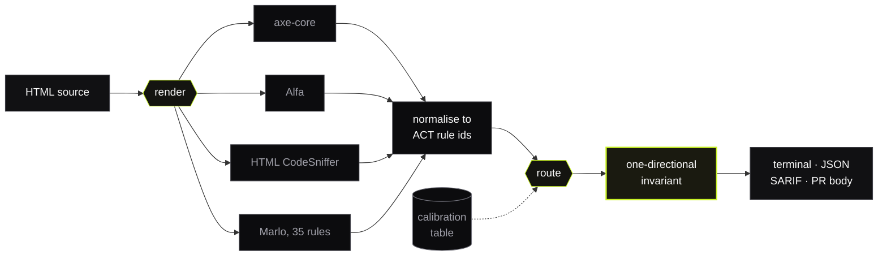
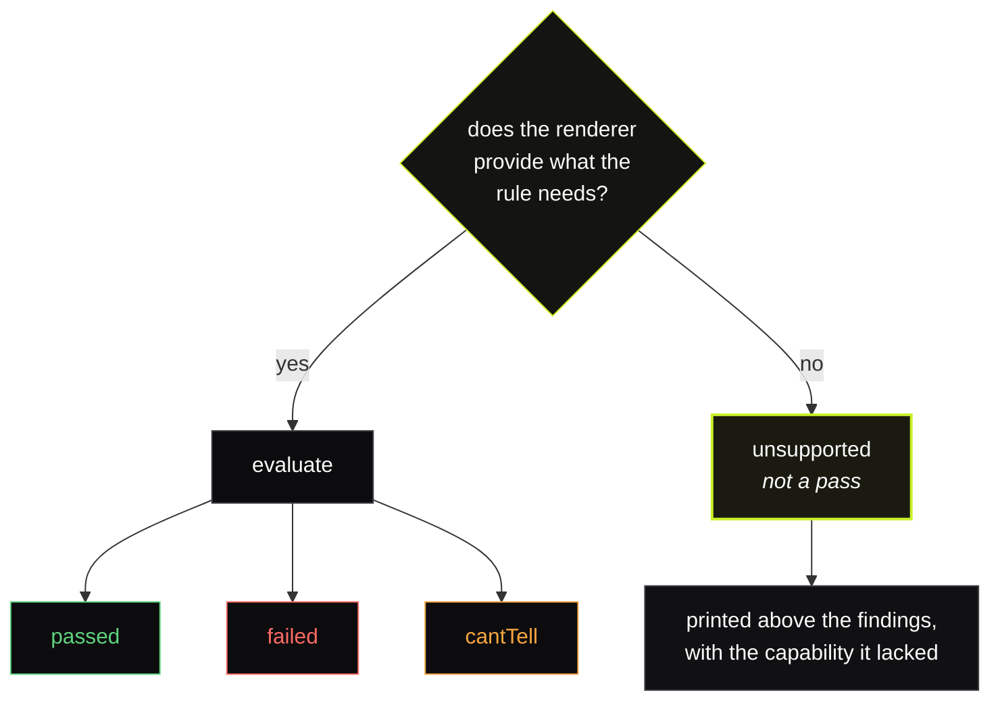

# Marlo

**Our false positive rate is 12.9%. Here is how we measured it, and why we are printing it.**

[](https://github.com/KarthikSubramanian07/Marlo/actions/workflows/ci.yml)
[](calibration/README.md)
[](calibration/README.md)
[](LICENSE)

Every accessibility tool claims to be accurate. Not one of them will tell you how often it is wrong.

Marlo will. It checks pages against the [official W3C ACT rule corpus](https://act-rules.github.io), then measures itself against that same corpus and commits the result to this repository. The numbers are regenerated in CI on every push. When one gets worse, the build fails.

**[trymarlo.pages.dev](https://trymarlo.pages.dev)** · [the numbers](calibration/README.md) · [where Marlo was wrong](HONESTY.md)

---

## The table nobody else publishes

Four engines, 447 official test case outcomes, one code path, no exemptions.

| Engine           | Rules  | Precision    | Recall    | False positives |
| ---------------- | ------ | ------------ | --------- | --------------- |
| Alfa             | 21     | 0.969        | 0.839     | **1.6%**        |
| axe-core         | 38     | 0.952        | 0.777     | 2.0%            |
| **Marlo**        | **35** | **0.714**    | **0.621** | **12.9%**       |
| HTML CodeSniffer | 15     | not measured | 0.000     | 0.0%            |

Marlo is third of four. Alfa and axe-core are both more precise and more sensitive, and the router sends 22 rules to axe-core against 12 to Marlo's own engine.

Nobody edited that. Marlo's engine goes through the same harness, on the same corpus, with no special case, because a table where the author's own engine happened to win would be worth exactly nothing. That is [D-008](DECISIONS.md#d-008), and it is the reason to believe any other number here.

---

## Why this is the product

Lighthouse returns 100 on pages a screen reader cannot get through. A major AI site builder shipped an unusable product and its own bundled checker reported perfection. The best-funded vendor in the category advertises "19x more critical issues" without defining the term. The overlay industry asserted compliance until a regulator turned up with a fine.

None of that happened because detection is hard. It happened because **an unverifiable claim costs nothing to make.**

So Marlo's differentiator is not better fixes. It is that its error rate is a number you can look up, recompute, and file a dispute about.

---

## What using it looks like

```
$ marlo scan checkout.html

checkout.html
  static renderer  dom, script

  NOT EXAMINED  2 rules need layout and paint, which this renderer does not provide.
                09o5cg afw4f7
                This is not a pass. Use --renderer browser to evaluate them.

  ▲▲▲ critical e086e5  Form field has non-empty accessible name
      WCAG 1.3.1, 2.5.3, 4.1.2  marlo precision 0.75 over 17 official test cases
      INVARIANT marlo reported a failure the routed engine did not, so Marlo may not report clean.
      disagreement: axe-core says passed
        A placeholder ("Email") is not a label: it disappears on focus and is not
        reliably announced.

  ------------------------------------------------------------
  12 findings   0 fixed   0 flagged   2 not evaluated   0 crashed
  coverage: 35 of 94 published ACT rules
  calibration 2026-07-30, corpus 2026-07-29
```

Three things there that most scanners will not show you.

**What it could not check, before what it found.** Two rules need CSS layout, the default renderer has none, and it says so above the findings rather than in a footnote. "No contrast problems were found" and "contrast was not examined" are different sentences.

**Where the confidence came from.** `marlo precision 0.75 over 17 official test cases`. Go and disagree with it.

**A disagreement between engines, on the record.** The calibration table routes that rule to axe-core, which did not flag a placeholder-only input. Marlo's own rule did. The invariant forced the failure through and named the dissenter.

Severity is a text mark, never colour on its own, so the output survives a pipe, a CI log, and a reader who cannot tell red from amber.

---

## Five minutes, from nothing

```bash
git clone https://github.com/KarthikSubramanian07/Marlo.git
cd Marlo
pnpm install
pnpm check                          # 404 tests. No network, no API key, no browser.
pnpm build && node packages/cli/dist/bin.js scan your-page.html
```

If any of that needs the network after `install`, it is a bug. The whole suite runs offline against a vendored corpus, and that is the only reason the offline claim in this README is worth reading.

|                        |                                                                         |
| ---------------------- | ----------------------------------------------------------------------- |
| `pnpm check`           | Everything CI runs                                                      |
| `pnpm calibrate`       | Regenerate the accuracy table (about three minutes)                     |
| `pnpm calibrate:check` | The CI gate: fails on a regression **and** on an unrecorded improvement |
| `pnpm corpus:verify`   | Prove the 1134 vendored test cases are unmodified                       |
| `pnpm screenshots`     | Capture the site at iPhone, iPad and laptop widths, and audit it        |
| `pnpm deploy`          | Build the site and ship it                                              |

---

## How it actually works



The two accented boxes are the seams, and the thick one is the rule that can override everything upstream of it.

**Marlo routes. It does not pile findings up and call the pile thorough.**

There was a project that integrated ten engines and around a thousand rules. Published at SIGACCESS, adopted inside a Fortune 50 company, reached almost nobody. The research it cites explains why: accessibility engines find largely _disjoint_ issue sets with poor agreement, so unioning them raises recall and buries the signal. Hand somebody ten engines' output and you have given them a triage problem, which is worse than the detection problem they started with.

So the calibration table decides which engine reports each rule, and you get one finding with provenance attached. [D-003](DECISIONS.md#d-003).

**Routing decides who speaks. It does not let anyone silence a peer.** If any engine reports a failure, Marlo may not report clean. It can dissent, on the record, with the disagreeing engine named.

| The routed engine says | A peer says | Marlo reports |                                        |
| ---------------------- | ----------- | ------------- | -------------------------------------- |
| failed                 | anything    | **failed**    | agreement, or the routed engine alone  |
| passed                 | **failed**  | **failed**    | the invariant fires, the peer is named |
| cantTell               | **failed**  | **failed**    | the invariant fires                    |
| passed                 | cantTell    | passed        | caution is not evidence                |
| unsupported            | anything    | never a pass  | the renderer could not look            |

Tested over all **256** combinations of four engines and four outcomes, because an invariant checked by three examples is an anecdote. The file is held at 100 percent coverage on every metric, and two of its branches were deleted rather than tested when they turned out to guard states the schema now forbids.

**A rule declares what it needs; a renderer declares what it has.** A rule whose needs are unmet reports `unsupported`, which is never a pass anywhere in the codebase. That one rule is what lets the default path run with no browser at all without quietly claiming coverage it does not have. [D-005](DECISIONS.md#d-005).



There is no arrow from the right-hand branch back to `passed`. That absence is the whole design: the type system has no way to turn "could not look" into "looked and it was fine".

It is enforced structurally rather than by review. The suite runs every rule twice, once with resolved styles and once without, and fails if a rule that did not declare `layout` changes its verdict.

axe-core reached the same conclusion independently, which was a pleasant surprise: run over all 19 test cases for the minimum-contrast rule under the same Node DOM, it returned "cannot tell" every time and "failed" never, because the colours cannot be resolved without layout.

---

## The finding that reshaped the project

W3C defines how to grade an implementation against a rule's official test cases. Under that protocol, `cantTell` is an allowed answer for **every** example type.

So a tool that answers "cannot tell" to all 1134 test cases is, officially, a correct implementation of all 91 rules that have them.

That is not a flaw in the protocol. It grades whether a tool _misleads_ you, and "I don't know" misleads nobody. It is simply not the question a developer is asking, which is whether the violation will actually be found.

So the calibration table publishes **both** views and computes the gap. Three entries currently grade as officially `consistent` while missing more than half the violations a real user would hit:

| ACT rule | Engine    | W3C verdict | Strict recall |
| -------- | --------- | ----------- | ------------- |
| `5c01ea` | **Marlo** | consistent  | 0.000         |
| `c487ae` | **Marlo** | consistent  | 0.273         |
| `3ea0c8` | axe-core  | consistent  | 0.000         |

Two of the three are ours. Under the protocol W3C publishes implementation reports against, Marlo is a **correct implementation** of `5c01ea` while detecting nothing at all. [D-004](DECISIONS.md#d-004).

---

## Five ways in, one set of numbers

|                   |                                                  |                                                                  |
| ----------------- | ------------------------------------------------ | ---------------------------------------------------------------- |
| **CLI**           | `marlo scan`, `explain`, `coverage`              | Exits 1 on findings, 3 on a rule it could not evaluate           |
| **Library**       | `@marlo/cli`, `@marlo/report`                    | The pipeline and the surfaces, importable                        |
| **SARIF 2.1.0**   | `--sarif`                                        | Per-engine provenance on every result, for the code scanning tab |
| **GitHub Action** | [`.github/actions/marlo`](.github/actions/marlo) | Refuses a token with `contents: write` before it does any work   |
| **MCP**           | [`@marlo/mcp`](packages/mcp)                     | Three read-only tools. No `fix` tool, and there will not be one  |

The last two are where the safety promise stops being prose. In an Action, "Marlo never pushes" is a statement about a permission, so the Action reads the permissions it was handed and stops if they exceed the job. Over MCP, a model calls tools with no human in between, so the server has no tool that writes and a test asserts the package does not import `writeFileSync` at all.

---

## Where it will not help you

- **It is not comprehensive and never says it is.** 35 of 94 published ACT rules, and automation reaches a minority of WCAG regardless.
- **It will not recolour your design.** Contrast is detected and located, never changed.
- **It will not invent alt text.** Decorative images get an empty alt confidently. A description is written only where the page already supplies the meaning. Everything else comes back to you, because a confident wrong description is worse than an absent one: you can notice an absence. [D-009](DECISIONS.md#d-009).
- **It cannot certify anything.** Nobody can. You get verified repair against named success criteria and a published error rate.
- **Repair covers seven rules, and applies two of them.** `marlo fix` has codemods for seven, and on the current table only two clear the accuracy gate. The other five arrive as flags with the generated change attached and the precision that disqualified it. A gate that admits everything is not a gate.

## What it will never do

**Marlo will never sell remediation services, and never sell a conformance report to anyone it rates.**

Every incumbent that both rates and remediates has a commercial reason to find problems it can be paid to fix. Independence is the only asset a measurement tool has, and it is not the sort of thing you get back after you spend it.

It also never merges its own pull requests, never pushes to your default branch, never force pushes, and never deploys. Enforced in the requested token scopes and asserted by tests, not promised in prose. [SECURITY.md](SECURITY.md).

---

## Contributing: the shortest path is telling us we were wrong

**[Report a false positive.](https://github.com/KarthikSubramanian07/Marlo/issues/new?template=false-positive.yml)** The most valuable message this project can receive, and deliberately the easiest thing to do here. You do not need to know which ACT rule fired or which engine reported it. Every confirmed one becomes a fixture, so the same mistake fails the build afterwards.

**[Implement a rule.](https://github.com/KarthikSubramanian07/Marlo/issues?q=is%3Aissue+is%3Aopen+label%3Atype%3Anew-rule)** One file, one registry line, one fixture set. The backlog is sized so each one is an afternoon, and you should not need to read the pipeline; if you do, that is a bug in the rule interface and worth its own issue.

A rule that measures badly still gets merged. It is published with its real numbers and the router sends that rule to a better engine. What cannot be merged is a rule with **no** measurement, because then the table would hold an assertion instead of a fact.

**[Dispute a number.](https://github.com/KarthikSubramanian07/Marlo/issues/new?template=calibration-dispute.yml)** A published figure being wrong is a defect in the thing this project is for, so it outranks a feature request.

[CONTRIBUTING.md](CONTRIBUTING.md) · sign off with `git commit -s` ([DCO, not a CLA](DECISIONS.md#d-001), because putting a legal document in front of an annoyed bug reporter is how you lose the report)

---

## Reading order, if you have twenty minutes

|                                                |                                                                                  |
| ---------------------------------------------- | -------------------------------------------------------------------------------- |
| [RESEARCH.md](RESEARCH.md)                     | What was measured before any code was written, and the eight things it rules out |
| [DECISIONS.md](DECISIONS.md)                   | Twelve decisions, each stating what would make it wrong                          |
| [HONESTY.md](HONESTY.md)                       | Ten entries. Every defect found during the build, with what reported success     |
| [calibration/README.md](calibration/README.md) | The generated table, per rule, per engine                                        |
| [ARCHITECTURE.md](ARCHITECTURE.md)             | How a page moves through the pipeline                                            |
| [HANDOFF.md](HANDOFF.md)                       | What is real, what is stubbed, what is deferred, and the traps                   |

`HONESTY.md` existed before the product did. It is not a postmortem, it is a design constraint: a project whose claim is "we tell you when we are wrong" needs somewhere to write that down before it has anything to be wrong about.

---

## Built on

[axe-core](https://github.com/dequelabs/axe-core) (MPL-2.0, unmodified) · [Alfa](https://github.com/Siteimprove/alfa) (MIT) · [HTML CodeSniffer](https://github.com/squizlabs/HTML_CodeSniffer) (BSD-3-Clause) · [happy-dom](https://github.com/capricorn86/happy-dom) (MIT) · the [ACT-Rules Community corpus](https://act-rules.github.io) (W3C Software and Document Licence)

Marlo's epistemology, its one-directional invariant, its alt-text policy and five of its tests are lifted from [`krishaygarg/ada_pdf_remediation`](https://github.com/krishaygarg/ada_pdf_remediation), a sibling project that does this for PDFs and documents three cases where its own auditor confirmed its own bugs. Full obligations in [docs/licenses.md](docs/licenses.md).

MIT. The repository is public because an unauditable verifier is a contradiction: "trust our error rate" is the same sentence as "trust our compliance score", and that sentence is the reason this exists.
